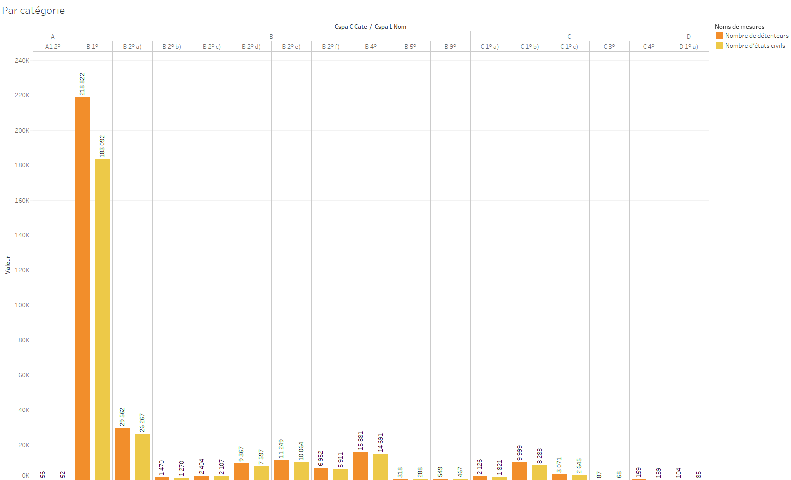
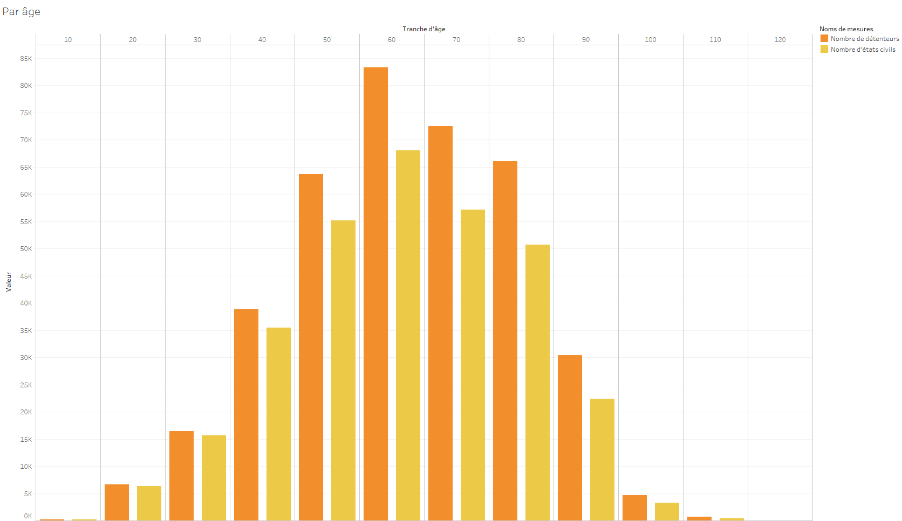
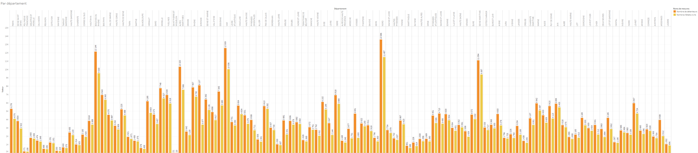
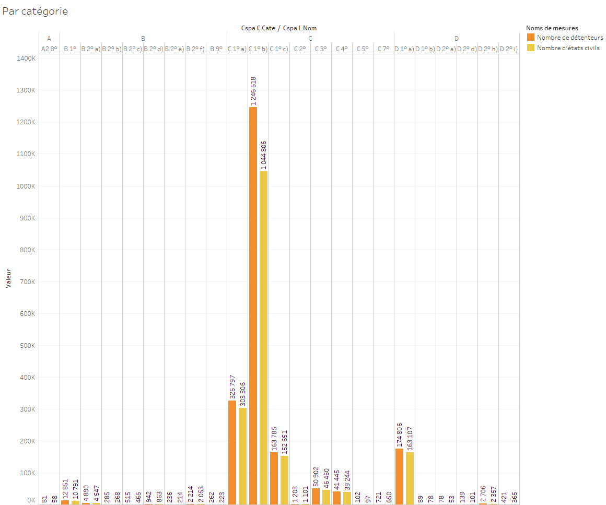
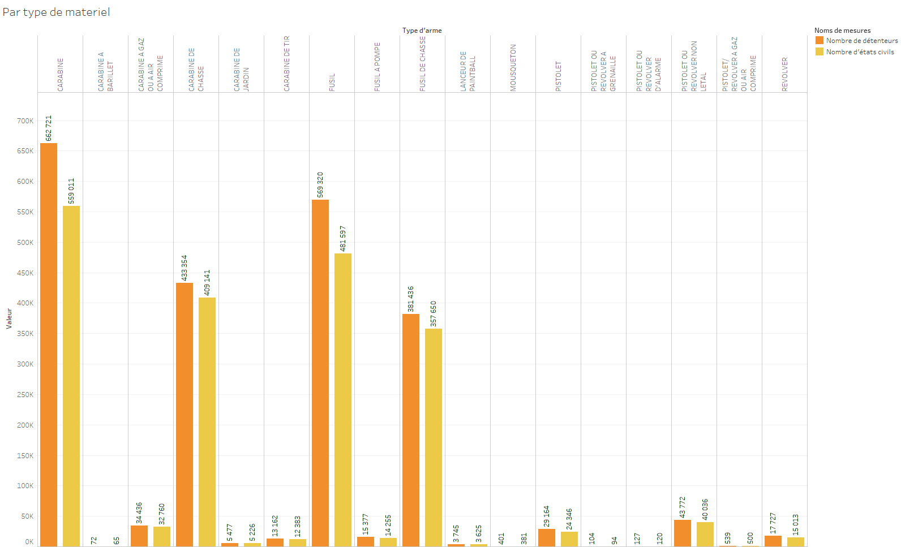
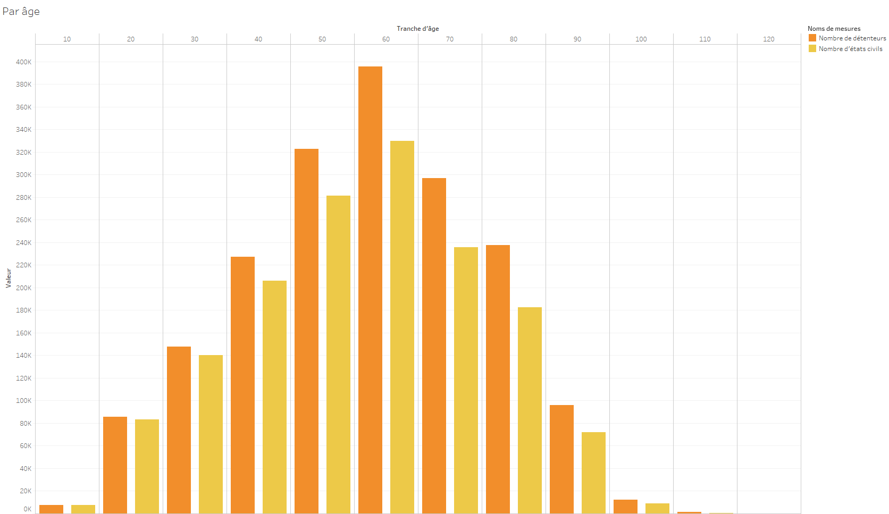
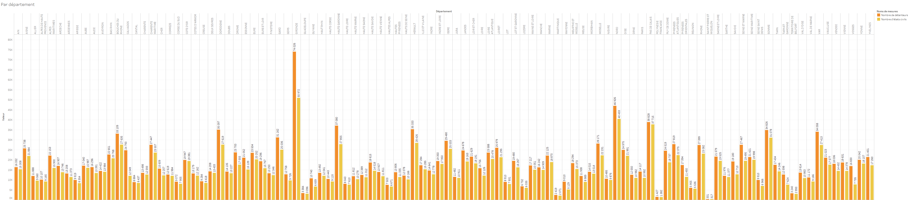
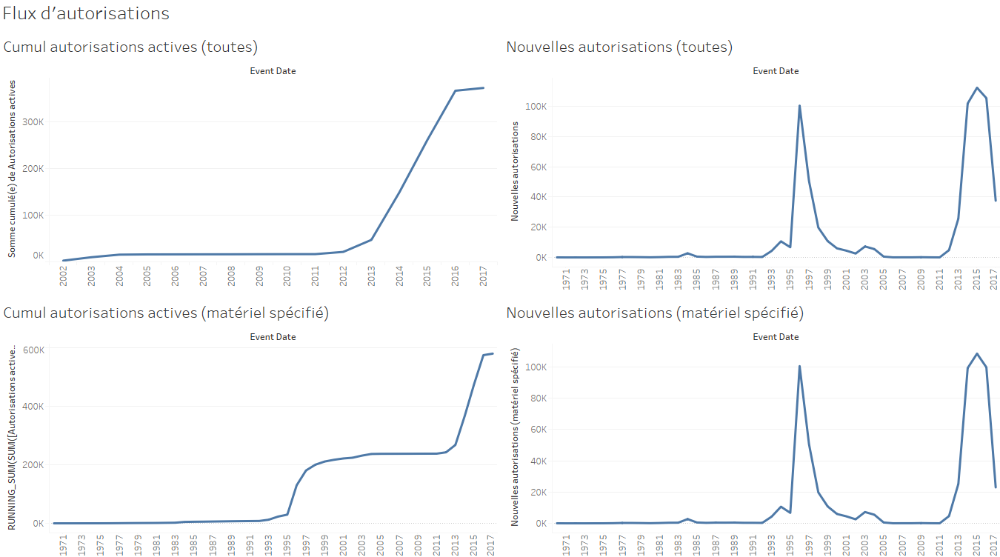
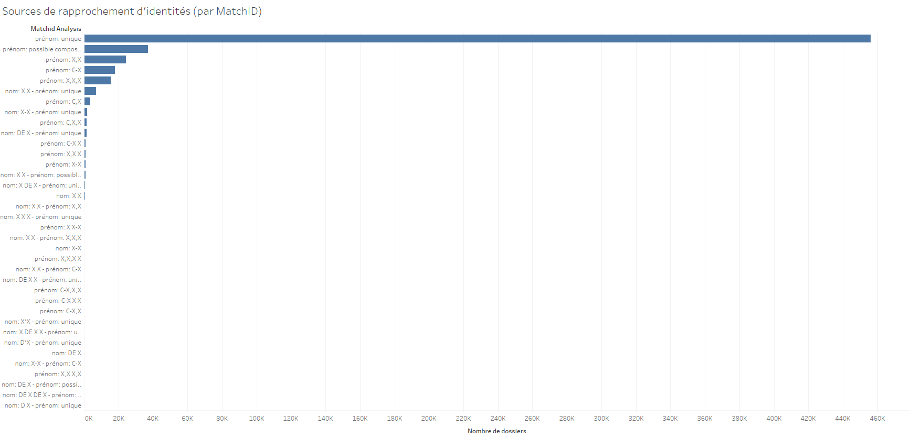
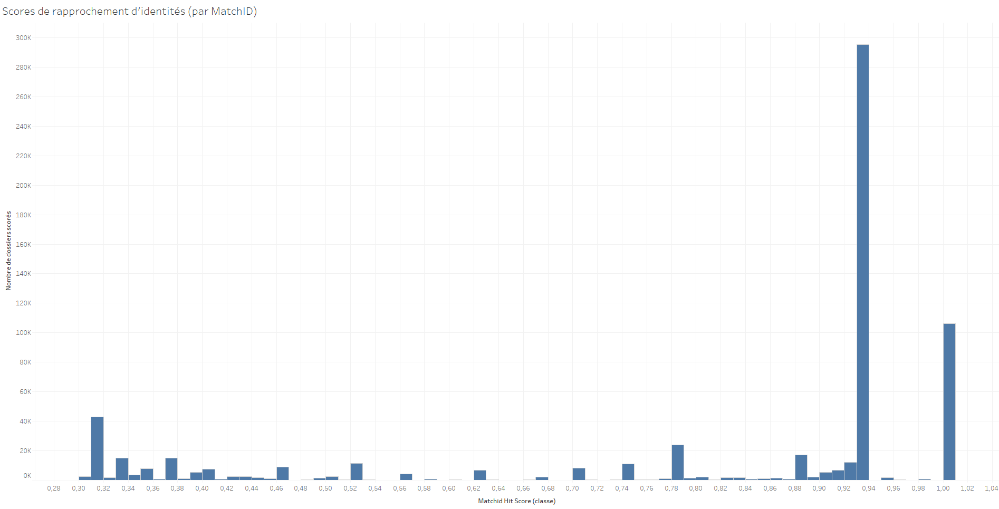

# *Analyse initiale des données AGRIPPA*

----

# Statistiques générales

### Décompte des entités

- **Problème données ?** Autorisations accordées sans dates de début ou fin : 332144
- Nombre d'autorisations actives : 56357
- Nombre d'armes ayant une autorisation active : 55885
- Durée moyenne cumulée (en mois) d'autorisation d'une arme : 31
- Nombre moyen d'autorisations par dossier : 1.18

### Décompte des armes par statut

- Détenteur non décédé, arme autorisée : 347898
- Détenteur décédé, arme plus autorisée : 3
- Détenteur décédé, arme toujours autorisée : 5460
- **Problème données ou de terrain ?** Détenteur décédé, arme réautorisée : 331590

----

# Identification des détenteurs

### Choix de la méthode d'identification

Un point préalable à une analyse plus fiable de ce jeu de données concerne la façon d'identifier de façon unique les détenteurs d'armes. L'objectif est d'obtenir des comptes corrects en résolvant les deux types d'erreur suivants  :
* on appelle ici doublon un "match manqué", i.e. deux enregistrements A et B non rapprochés alors qu'ils correspondent à la même identité de personne physique
* on appelle ici collision un "faux match", i.e. deux enregistrements A et B rapprochés en raison de valeurs de nom, prénom, date et lieu de naissance, alors qu'ils correspondent à des personnes physiques différentes

En effet, les données ne semblent pas contenir d'identifiant unique fiable pour les détenteurs d'armes, notamment des doublons existent dans le champ `CDET_ID`. L'analyse présentée ici utilise donc 3 types d'identification des détenteurs d'armes :
1. en se basant sur le champ `CDET_ID`
2. en opérant un dédoublonnage initial sur l'état-civil (nom/prénom/date de naissance) avec l'élimination de la plupart des doublons sur le `CDET_ID` mais l'introduction de nouveaux doublons pour les homonymes
3. en opérant un dédoublonnage plus poussé a été fait en se basant sur les résultats de MatchID (matching flou sur les attributs d'état-civil notamment) et en réalisant un clustering des identités à partir du graphe constitué des enregistrements ainsi appariés

Ces différents types d'identification apparaissent dans les visualisations Tableau "... par détenteur / état-civil / MatchID".

### Impact de la méthode d´identification

 Le tableau suivant donne le décompte total de détenteurs dans Agrippa selon chacune des 3 méthodes :

|Type d'identification|Décompte|
|---|---|
|1. Total détenteurs par CDET_ID |2341434|
|2. Total détenteurs par état-civil |2149707|
|3. Total détenteurs par MatchID |2077913|

On voit donc que la simple identification par état-civil permet d'éliminer environ 9% de doublons, et celle par analyse MatchID d'en éliminer 11%. 

### Performance de la méthode d'identification

Reste à estimer la performance de l'identification ainsi opérée. 

#### Analyse qualitative

Qualitativement, la comparaison des clusters complets vs. incomplets, ainsi que le faible diamètre des clusters, indiquent que le dédoublonnage basé sur ces clusters est assez fiable :

_Clusters incomplets vs. complets_

|Type de clusters|Nombre de tels clusters|
|---|---|
|Détenteurs dans clusters complets (appelés cliques) | 975763|
|Détenteurs dans clusters incomplets | 103445|

_Taille des cliques_

|Taille de clique incomplète|Nombre de cliques|
|---|---|
|>20|<100|
|20|151|
|19|117|
|18|196|
|17|231|
|16|267|
|15|347|
|14|484|
|13|613|
|12|910|
|11|1280|
|10|1701|
|9|2787|
|8|4418|
|7|7200|
|6|12589|
|5|19466|
|4|20818|
|3|29127|

#### Analyse quantitative

Afin de compléter cette estimation qualitative de la méthode d'identification retenue, une estimation quantitative peut être réalisée via une analyse manuelle des "faux doublons" sur un échantillon.

_Estimation du nombre de doublons non résolus_

La principale cause d'identités doublonnées qui demeure (i.e. d'un taux de rappel suboptimal) correspond à des erreurs de saisie et/ou des problèmes de cohérence, par exemple : commune de naissance ayant été rebaptisée et saisie deux fois avec deux noms différents, combinée à une date de naissance saisie avec une valeur par défaut dans un des deux cas. Le nombre de tels cas est par principe impossible à estimer.

_Estimation du nombre de collisions non résolues_

La principale cause de collisions d'identité qui demeure (i.e. d'un taux de précision suboptimal) correspond à des clusters d'identité indûment fusionnés par notre méthode 3 ci-dessus. 

La situation la plus courante est celle d'enregistrements ayant exactement les mêmes nom de famille, prénom (éventuellement 2e et 3e prénom), et date de naissance, sans indication de lieu de naissance. Deux cas sont alors possibles : soit tous ces enregistrements ont le même lieu de naissance (on les nomme alors "jumeaux parfaits"), soit ils possèdent k lieux de naissance, k>=2 (on parle alors de "k-jumeaux imparfaits").

* Méthode empirique d'estimation :

Une première estimation du taux de jumeaux imparfaits est donnée par un décompte sur un jeu de données suffisamment fiable, ce que nous faisons ici sur deux exemples

Sur le SNPC (nombre d'identités total 49814656) :

|k|Nombre de k-jumeaux imparfaits|
|---|---|
|2|32419|
|3|172|
|4|6|

|k|Nombre de k-jumeaux parfaits|
|---|---|
|2|1481574|
|3|2758|
|4|2575|
|5|3|
|6|21|
|7|1|
|8|5|
|10|1|
|26|1|
|36|1|

De ces deux histogrammes, on conclut que les k-jumeaux pour k>2 sont négligeables par rapport aux 2-jumeaux, et que la proportion de jumeaux imparfaits vs. parfaits, une approximation du taux de collisions en cas d'ambiguïté sur le lieu de naissance est de 2,22% - et surtout que le nombre d'erreurs d'identification dues aux erreurs de saisie de lieu de naissance est au pire de 6 pour 10000.

Même analyse sur le RNIPP (nombre d'identités total 23126717) :

|k|Nombre de k-jumeaux imparfaits|
|---|---|
|2|7379|
|3|48|
|4|1|
|5|1|
|6|1|

|k|Nombre de k-jumeaux parfaits|
|---|---|
|2|101532|
|3|1230|
|4|15|
|5|2|

Le constat est le même que pour le SNPC, avec une proportion de jumeaux imparfaits vs. parfaits de 7,26% et un nombre d'erreurs d'identification dues aux erreurs de saisie de lieu de naissance encore plus faible : au pire de 3 pour 10000.

* Méthode probabiliste d'estimation :

Afin de valider cette estimation empirique, on peut calculer un ordre de grandeur de façon probabiliste et non plus statistique. Ainsi on estime le nombre de collisions de ce type à partir de la probabilité d'une collision sur l'état-civil moins le lieu de naissance :

Comme on a 1079208 clusters (cliques ou clusters incomplets), la probabilité de zéro collision sur la date de naissance est : 
`exp(- 1079208 * 1079207 / (2 * 365 * 120))`
et le nombre moyen de collisions sur la date de naissance est de :
`n - d + d ((d-1)/d)^n = 1042708`

Noter également que l'algorithme MatchID ne ŕéconcilie ces enregistrements (ce qui conduit à fusionner les cliques correspondantes) que si les combinaisons prénom/nom sont suffisamment rares, donc la probabilité réelle de collisions est encore plus faible.

### Causes de doublons/collisions

Il existe différentes causes liées à la qualité des données pour expliquer collisions et doublons sur les identités. Ces enregistrements de mauvaise qualité induisent en général peu d'erreurs sur ĺes statistiques concernant l'ensemble des 2388663 détenteurs mais peuvent induire des erreurs non négligeables sur les statistiques par détenteur. (Ils sont de toute façon filtrés dans toutes les analyses décrites ici, même celles agrégées sur l'ensemble des données.) 

|Cause de doublons/collisions|Volume|
|---|---|
|Détenteurs sans lieu de naissance|362825|
|Enregistrements avec un patronyme "INCONNU"|4269|
|Détenteurs sans date de naissance|2735|

Noter enfin que les causes intrinsèques de collisions sont négligeables par rapport à ces problèmes de qualité : par exemple la probabilité d'un jumeau parfait - comme décrit plus haut - est inférieure de plusieurs ordres de grandeur à celle de jumeaux imparfaits dûs à l'absence de lieu de naissance dans la base de données.

----

# Points à clarifier 

Cette section contient surtout des questions à destination des experts métier afin de clarifier notre (côté MGMSIC) compréhension du modèle de données, et donc de déterminer si certains observations correspondent à des anomalies réelles ou pas.

### Dates de début et fin d'autorisation

Un grand nombre d'autorisation n´ont pas de date de fin (champ `AUTO_D_FIN_date`).

### Catégorie manquante

On observe 27% des armes sans catégorie (`CEUR_C_CLAS_EURO`), est-ce normal ?

### Déclaration nécessaire à autorisation

Est-ce le cas pour toutes les catégories A-D, ou uniquement pour les armes nécessitant une autorisation (catégorie B et éventuellement A) ?

### Durée de déclaration et d'autorisation

La durée standard est de 3 ans, passée à 5 ans, quelle est la date exacte du changement de réglementation ? certains détails réglementaires ou législatifs expliquent-ils les durées observées différentes de ces deux valeurs ?

### Définition over quota

Est-ce toujours un maximum de 12 armes autorisées pour un même individu, ou faut-il prendre en compte les catégories spéciales impliquant un quota plus bas (10) ?

### Statut des dossiers

Pour un dossier donné (`DOSS_ID`) on peut avoir plusieurs demandes de déclaration / autorisation / carte européenne, avec un statut donné par `ETAD_L_LIB`, faut-il prendre en compte les valeurs autres que "Valide" pour ce statut ? (Pour l'instant toutes les mesures agrégées sont filtrées sur la validité des déclarations ou autorisations correspondantes, ce qui résoud les problèmes d'armes "multi-actives".)

### Détenteurs décédés

Un grand nombre d'incohérences entre date de déclaration de décès et date effective de décès, qui introduisent des erreurs statistiques et particulièrement sur les données les plus sensibles en matière de détention d'armes :

- Rien qu'en se limitant aux détenteurs d'armes avec autorisation valide, on a 70028 incohérences entre les jours de décès et 3710 incohérences entre les années de décès
- Pour les détenteurs d'armes avec déclaration, on a 307287 incohérences entre les jours de décès et 15159 incohérences entre les années de décès

----

# Reproduction des statistiques publiques

### Total armes à autorisation active + Total armes à déclaration

D'après [Wikipedia](https://fr.wikipedia.org/wiki/Contr%C3%B4le_des_armes_%C3%A0_feu_en_France) :

	En 2009, la France compterait légalement 762 331 armes soumises à autorisation (actuelle catégorie B), et 2 039 726 armes soumises à déclaration

Avec notre analyse des données Agrippa, on obtient les volumes suivants pour les armes autorisées :

|Définition|Volume|
|---|---|
|Armes de catégorie B ayant une autorisation active en 2017|55875|
|Armes de catégorie B ayant une autorisation active au 01/01/2009|24633|
|Cumul historique en 2017|171795|
|Cumul historique au 01/01/2009|49846|
|Cumul historique d'autorisations valides|668634|
|Cumul historique (incluant les autorisations non datées)|937633|
|Nombre d'autorisations datées avant le 01/01/2009|553168|

Étant donné que 331590 armes ont une autorisation valide *et non datée*, en extrapolant le taux de données manquantes sur ces champs dates au volume d'autorisations global, on obtient une estimation du nombre d'armes autorisées en 2009 de 748793, proche des 762331 annoncées.

Quant aux déclarations, comme elles ne nécessitent pas de date de début et de fin contrairement aux autorisations, il est plus difficile d'estimer leur nombre en 2009 à partir des données actuelles, non historicisées. Le nombre d'armes déclarées valides en 2017 est 3138840, donc d'un ordre de grandeur correct face aux 2039726 annoncées en 2009, sans pouvoir vérifier plus précisément ce chiffre.

----

# Visualisations

Outre les visualisations suivantes, des visualisations disponibles sous Tableau fournissent des statistiques générales sur le nombre d'armes enregistrées (déclarées ou autorisées) : 
- par catégorie d'arme, total
- par catégorie d'arme, par détenteur / état-civil
- par type de matériel, total
- par type de matériel, par détenteur / état-civil
- par âge, total
- par âge, par détenteur / état-civil
- par département, total
- par département, par détenteur / état-civil

### Décompte des autorisations

### Décompte des déclarations

### Décompte des autorisations actives

### Identification des détenteurs 

